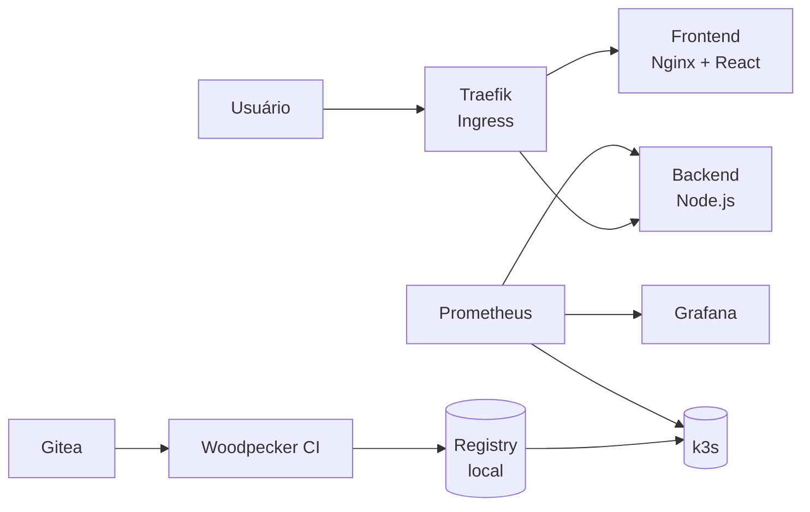
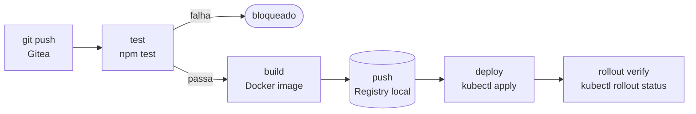

# Homelab
 
> Ambiente de estudos DevOps self-hosted. Usando Backend Node.js + Frontend React como base para aprender infraestrutura, CI/CD, Kubernetes e observabilidade em hardware local.

---
 
## Índice
 
- [Visão Geral](#visão-geral)
- [Hardware](#hardware)
- [Stack](#stack)
- [Arquitetura](#arquitetura)
- [Estrutura do Repositório](#estrutura-do-repositório)
- [Execução Local](#execução-local)
- [Variáveis de Ambiente](#variáveis-de-ambiente)
- [API](#api)
- [Kubernetes](#kubernetes)
- [Ansible](#ansible)
- [Testes](#testes)
- [CI/CD](#cicd)
- [Roadmap](#roadmap)

---
 
## Visão Geral
 
O Homelab é um ambiente de estudos DevOps self-hosted. A aplicação em si é simples um backend Node.js/Express e um frontend React para justamente o foco ficar na infraestrutura.
 
O projeto cobre os principais pilares de DevOps em ambiente local:
 
- **Containers:** Docker Engine + Compose, multi-stage build, usuário não-root
- **Orquestração:** k3s single-node evoluindo para multi-node
- **CI/CD local:** Gitea + Woodpecker CI, pipeline de build e deploy
- **Observabilidade:** Prometheus + Grafana, Node Exporter, cAdvisor
- **IaC:** Ansible para recriar o setup do zero, playbooks versionados no Gitea
---
 
## Hardware (Ainda Preciso Comprar)

Atualizado em 14/07/2026 — não é mais um único servidor: a frota é composta por múltiplas máquinas físicas com papéis diferentes.

| Papel | Hardware | Quantidade | Função |
|---|---|---|---|
| Brain | Lenovo M920q | 1–3 (dia 1: 1, e a 1ª compra real) | Proxmox VE, hospeda só a VM de control-plane do k3s |
| Worker | HP EliteDesk 800 G4 (i5) | 2–3 (dia 1: 2) | Bare-metal, roda `k3s-agent` direto |
| DNS/adblock | — | — | Pi-hole rodando como workload do k3s, replicado em 2 workers |
| Storage | NAS | — | Muito futuro, baixa prioridade |

**Sem Raspberry Pi**: custava igual (~R$2.000) a um brain/worker no mercado do autor e não desbloqueava nada do cluster sozinho — cortado do plano. Bastion vira o próprio computador do autor (Ansible é agentless); DNS/adblock viram um workload replicado dentro do cluster.

Aquisição incremental (não dá pra comprar tudo de uma vez): playbooks Ansible testados em VM local sem custo, depois o 1º M920q (com VMs de worker temporárias nele até os EliteDesk chegarem), EliteDesk por último substituindo as VMs temporárias por workers bare-metal reais.

Sem acesso admin ao roteador principal — IP fixo é configurado por host via Ansible/netplan, não por reserva de DHCP.
 
---
 
## Stack

### Atual

| Camada | Tecnologia |
|--------|-----------|
| Frontend | React + Vite |
| Backend | Node.js + Express |
| Containers | Docker + Docker Compose |
| Orquestração | Kubernetes (k3s) |
| Ingress | Traefik (incluso no k3s) |

### Futura

| Camada | Tecnologia |
|--------|-----------|
| CI/CD | Woodpecker CI |
| Source Control | Gitea |
| Registry | Docker Registry (self-hosted) |
| Observabilidade | Prometheus + Grafana |
| IaC | Ansible + Terraform (OpenTofu) |
| Identidade/SSO | Authentik |
| Secrets | HashiCorp Vault |
| GitOps | ArgoCD + Kustomize |
| TLS interno | cert-manager |
| Migrations do banco | node-pg-migrate |
 
---
 
## Arquitetura (Alvo)
 

 
---
 
## Estrutura do Repositório
 
```
HomeLab/
├── backend/
│   ├── src/
│   │   ├── routes/
│   │   │   ├── api.js
│   │   │   ├── api.test.js
│   │   │   ├── health.js
│   │   │   └── health.test.js
│   │   ├── app.js
│   │   └── index.js
│   ├── Dockerfile
│   ├── .dockerignore
│   ├── .env.example
│   └── package.json
├── frontend/
│   ├── src/
│   │   ├── assets/
│   │   ├── App.css
│   │   ├── App.jsx
│   │   ├── index.css
│   │   └── main.jsx
│   ├── public/
│   ├── Dockerfile
│   ├── .dockerignore
│   ├── .env.example
│   ├── nginx.conf
│   └── package.json
├── e2e/
│   ├── container.test.js
│   └── smoke.sh
├── k8s/
│   ├── backend-deployment.yml
│   ├── frontend-deployment.yml
│   ├── ingress.yml
│   └── namespace.yml
├── ansible/
│   ├── ansible.cfg
│   ├── inventory/
│   │   └── test.ini
│   ├── playbooks/
│   │   └── bootstrap.yml
│   └── roles/
│       ├── common/tasks/main.yml
│       ├── k3s_control_plane/tasks/main.yml
│       └── k3s_worker/tasks/main.yml
├── .dockerignore
├── .env.example
├── .gitignore
├── docker-compose.yml
├── makefile
└── README.md
```
 
---
 
## Execução Local
 
### Pré-requisitos
 
- Docker Engine + Compose v2
- k3s (opcional, para testar os manifests)

### Com Docker Compose
 
```bash
cp backend/.env.example backend/.env
docker compose up --build
```
 
### Verificar os endpoints
 
```bash
curl http://localhost:3001/health
curl http://localhost:3001/api
```
 
O frontend estará disponível em `http://localhost`.
 
### Com k3s local
 
```bash
# buildar e importar as imagens
docker build -t homelab-backend:local ./backend
docker build -t homelab-frontend:local ./frontend
 
docker save homelab-backend:local -o /tmp/backend.tar
sudo k3s ctr images import /tmp/backend.tar
 
docker save homelab-frontend:local -o /tmp/frontend.tar
sudo k3s ctr images import /tmp/frontend.tar
 
# aplicar os manifests
kubectl apply -f k8s/namespace.yml
kubectl apply -f k8s/backend-deployment.yml
kubectl apply -f k8s/frontend-deployment.yml
 
# acessar via port-forward enquanto o Ingress não está configurado
kubectl port-forward -n homelab svc/frontend 8080:80
```
 
Frontend disponível em `http://localhost:8080`.
 
---
 
## Variáveis de Ambiente
 
```bash
cp backend/.env.example backend/.env
```
 
| Variável | Descrição | Padrão |
|----------|-----------|--------|
| `PORT` | Porta do servidor | `3001` |
| `NODE_ENV` | Ambiente de execução | `development` |
 
---
 
## API
 
| Método | Endpoint | Descrição |
|--------|----------|-----------|
| `GET` | `/health` | Status do servidor |
| `GET` | `/api` | Informações da API |
 
```bash
curl http://localhost:3001/health
# {"status":"ok","timestamp":"2026-01-01T00:00:00.000Z"}
 
curl http://localhost:3001/api
# {"message":"HomeLab API","version":"0.1.0"}
```
 
---
 
## Kubernetes
 
```bash
# verificar pods
kubectl get pods -n homelab
 
# verificar todos os recursos
kubectl get all -n homelab
 
# logs do backend
kubectl logs -n homelab deploy/backend -f
 
# acessar o frontend
kubectl port-forward -n homelab svc/frontend 8080:80
```

---

## Ansible

Usado pra **provisionar** o cluster k3s: pega uma VM crua e a transforma num node funcional (instala k3s, configura chrony, junta ao control-plane). É agentless — roda tudo via SSH, sem daemon instalado no destino. Provisionar é diferente de administrar: o que roda *dentro* do cluster depois (pods, deployments) é gerenciado pelo próprio Kubernetes/k3s, não pelo Ansible.

```
ansible/
├── ansible.cfg              # aponta o inventário e o roles_path
├── inventory/test.ini       # hosts de teste: cp-test, worker-test-01/02
├── playbooks/bootstrap.yml  # orquestra as roles, na ordem certa
└── roles/
    ├── common/              # chrony/NTP em todos os nós do cluster
    ├── k3s_control_plane/   # instala k3s server, extrai o token de join
    └── k3s_worker/          # instala k3s agent, usando o token do control-plane
```

```bash
cd ansible
ansible-playbook playbooks/bootstrap.yml
```

Requer SSH por chave em todos os hosts do inventário. Se a chave tiver passphrase, carregue um `ssh-agent` antes:

```bash
eval "$(ssh-agent -s)"
ssh-add ~/.ssh/id_ed25519
```

Verificar que o cluster subiu:

```bash
ssh <usuario>@<ip-do-control-plane> "sudo kubectl get nodes -o wide"
```

---

## Makefile

Atalhos para os comandos mais usados no dia a dia do projeto.

| Comando | Descrição |
|---------|-----------|
| `make up` | Sobe o ambiente local em background |
| `make down` | Derruba o ambiente local |
| `make ps` | Lista os containers em execução |
| `make logs` | Acompanha os logs em tempo real |
| `make test` | Roda os testes unitários do backend |
| `make e2e-supertest` | Sobe os containers, roda os testes E2E e derruba |
| `make dev-front` | Inicia o frontend em modo desenvolvimento |
| `make dev-back` | Inicia o backend em modo desenvolvimento |
| `make validate-k8s` | Valida os manifests Kubernetes com kubeconform |
 
---

## Testes

### Unitários

```bash
make test
# ou: cd backend && npm test
```

Testes de rotas com Jest + Supertest localizados em `backend/src/routes/*.test.js`.

### E2E (container)

```bash
make e2e-supertest
```

Sobe o stack via Compose, executa `e2e/container.test.js` contra `http://localhost:3001` e derruba os containers ao final.

### Smoke test

```bash
bash e2e/smoke.sh
```

Valida os endpoints via `http://localhost` (porta 80). Funciona com Docker Compose — o nginx do frontend faz proxy de `/api` e `/health` para o backend.

---
 
## CI/CD
 
O pipeline será configurado quando o homelab estiver de pé com Gitea e Woodpecker CI.
 
Fluxo planejado:


 
| Etapa | Descrição |
|-------|-----------|
| `test` | Executa `npm test`, bloqueia se falhar |
| `build` | Build das imagens Docker |
| `push` | Push para o registry self-hosted |
| `deploy` | Atualiza os manifests no k3s |
| `rollout verify` | Confirma que os pods subiram |
 
---
 
## Roadmap

- [x] Docker Compose funcionando localmente
- [x] k3s local com manifests adaptados
- [x] Testes E2E contra containers
- [x] Playbooks Ansible testados em VM local (brain, worker, k3s)
- [ ] Gitea, Woodpecker CI e Registry rodando dentro do k3s
- [ ] Traefik Ingress + TLS interno (cert-manager) + DNS wildcard via Pi-hole
- [ ] Prometheus + Grafana + Loki via Helm
- [ ] Authentik (SSO) na frente das UIs internas
- [ ] Schema real de banco de dados (deploy history) + dashboard admin no frontend
- [ ] 1º Lenovo M920q comprado e provisionado (Proxmox + control-plane + workers temporários em VM) — *trilha paralela, entra quando o orçamento permitir; não bloqueia os itens de software acima*
- [ ] HP EliteDesk 800 G4 comprados, substituindo os workers temporários por bare-metal — *trilha paralela*
- [ ] HashiCorp Vault (secrets) + ArgoCD (GitOps) + multi-brain HA
 
---
 
Para dúvidas, reporte issues no repositório ou entre em contato: [pedrolucasfonseca98@gmail.com](mailto:pedrolucasfonseca98@gmail.com)
