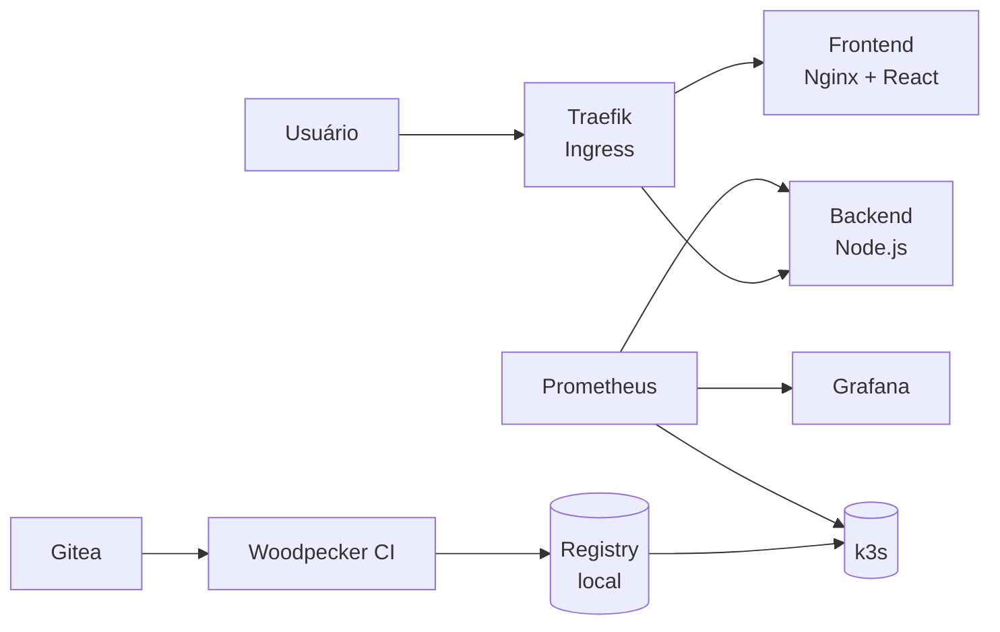

# Homelab
 
> Ambiente de estudos DevOps self-hosted. Usando Backend Node.js + Frontend React como base para aprender infraestrutura, CI/CD, Kubernetes e observabilidade em hardware local.

---
 
## Índice
 
- [Visão Geral](#visão-geral)
- [Hardware](#hardware)
- [Stack](#stack)
- [Arquitetura](#arquitetura)
- [Estrutura do Repositório](#estrutura-do-repositório)
- [Execução Local](#execução-local)
- [Variáveis de Ambiente](#variáveis-de-ambiente)
- [API](#api)
- [Kubernetes](#kubernetes)
- [CI/CD](#cicd)
- [Roadmap](#roadmap)

---
 
## Visão Geral
 
O Homelab é um ambiente de estudos DevOps self-hosted. A aplicação em si é simples um backend Node.js/Express e um frontend React para justamente o foco ficar na infraestrutura.
 
O projeto cobre os principais pilares de DevOps em ambiente local:
 
- **Containers:** Docker Engine + Compose, multi-stage build, usuário não-root
- **Orquestração:** k3s single-node evoluindo para multi-node
- **CI/CD local:** Gitea + Woodpecker CI, pipeline de build e deploy
- **Observabilidade:** Prometheus + Grafana, Node Exporter, cAdvisor
- **IaC:** Ansible para recriar o setup do zero, playbooks versionados no Gitea
---
 
## Hardware (Ainda Preciso Comprar)
 
| Componente | Especificação |
|------------|--------------|
| Servidor | Lenovo ThinkCentre M920q |
| CPU | Intel Core i5/i7 (8ª/9ª geração) |
| RAM | 16 GB (expansível) |
| SO | Ubuntu Server 24.04 LTS |
| Uso | Servidor dedicado 24/7 |
 
O ThinkCentre M920q foi escolhido pelo baixo consumo energético (~15–35W), alto custo-benefício, formato compacto e estabilidade para operação contínua
 
---
 
## Stack
 
| Camada | Tecnologia |
|--------|-----------|
| Frontend | React + Vite |
| Backend | Node.js + Express |
| Containers | Docker + Docker Compose |
| Orquestração | Kubernetes (k3s) |
| Ingress | Traefik (incluso no k3s) |
| CI/CD | Woodpecker CI |
| Source Control | Gitea |
| Registry | Docker Registry (self-hosted) |
| Observabilidade | Prometheus + Grafana |
| IaC | Ansible |
 
---
 
## Arquitetura
 

 
---
 
## Estrutura do Repositório
 
```
HomeLab/
├── backend/
│   ├── src/
│   │   ├── routes/
│   │   │   ├── api.js
│   │   │   ├── api.test.js
│   │   │   ├── health.js
│   │   │   └── health.test.js
│   │   ├── app.js
│   │   └── index.js
│   ├── Dockerfile
│   ├── .dockerignore
│   ├── .env.example
│   └── package.json
├── frontend/
│   ├── src/
│   │   ├── assets/
│   │   ├── App.css
│   │   ├── App.jsx
│   │   ├── index.css
│   │   └── main.jsx
│   ├── public/
│   ├── Dockerfile
│   ├── .dockerignore
│   ├── .env.example
│   ├── nginx.conf
│   └── package.json
├── k8s/
│   ├── backend-deployment.yml
│   ├── frontend-deployment.yml
│   ├── ingress.yml
│   └── namespace.yml
├── .dockerignore
├── .env.example
├── .gitignore
├── docker-compose.yml
├── makefile
└── README.md
```
 
---
 
## Execução Local
 
### Pré-requisitos
 
- Docker Engine + Compose v2
- k3s (opcional, para testar os manifests)

### Com Docker Compose
 
```bash
cp backend/.env.example backend/.env
docker compose up --build
```
 
### Verificar os endpoints
 
```bash
curl http://localhost:3001/health
curl http://localhost:3001/api
```
 
O frontend estará disponível em `http://localhost`.
 
### Com k3s local
 
```bash
# buildar e importar as imagens
docker build -t homelab-backend:local ./backend
docker build -t homelab-frontend:local ./frontend
 
docker save homelab-backend:local -o /tmp/backend.tar
sudo k3s ctr images import /tmp/backend.tar
 
docker save homelab-frontend:local -o /tmp/frontend.tar
sudo k3s ctr images import /tmp/frontend.tar
 
# aplicar os manifests
kubectl apply -f k8s/namespace.yml
kubectl apply -f k8s/backend-deployment.yml
kubectl apply -f k8s/frontend-deployment.yml
 
# acessar via port-forward enquanto o Ingress não está configurado
kubectl port-forward -n homelab svc/frontend 8080:80
```
 
Frontend disponível em `http://localhost:8080`.
 
---
 
## Variáveis de Ambiente
 
```bash
cp backend/.env.example backend/.env
```
 
| Variável | Descrição | Padrão |
|----------|-----------|--------|
| `PORT` | Porta do servidor | `3001` |
| `NODE_ENV` | Ambiente de execução | `development` |
 
---
 
## API
 
| Método | Endpoint | Descrição |
|--------|----------|-----------|
| `GET` | `/health` | Status do servidor |
| `GET` | `/api` | Informações da API |
 
```bash
curl http://localhost:3001/health
# {"status":"ok","timestamp":"2026-01-01T00:00:00.000Z"}
 
curl http://localhost:3001/api
# {"message":"HomeLab API","version":"0.1.0"}
```
 
---
 
## Kubernetes
 
```bash
# verificar pods
kubectl get pods -n homelab
 
# verificar todos os recursos
kubectl get all -n homelab
 
# logs do backend
kubectl logs -n homelab deploy/backend -f
 
# acessar o frontend
kubectl port-forward -n homelab svc/frontend 8080:80
```

---

## Makefile

Atalhos para os comandos mais usados no dia a dia do projeto.

| Comando | Descrição |
|---------|-----------|
| `make up` | Sobe o ambiente local em background |
| `make down` | Derruba o ambiente local |
| `make ps` | Lista os containers em execução |
| `make logs` | Acompanha os logs em tempo real |
| `make test` | Roda os testes do backend |
| `make dev-front` | Inicia o frontend em modo desenvolvimento |
| `make dev-back` | Inicia o backend em modo desenvolvimento |
 
---
 
## CI/CD
 
O pipeline será configurado quando o homelab estiver de pé com Gitea e Woodpecker CI.
 
Fluxo planejado:


 
| Etapa | Descrição |
|-------|-----------|
| `test` | Executa `npm test`, bloqueia se falhar |
| `build` | Build das imagens Docker |
| `push` | Push para o registry self-hosted |
| `deploy` | Atualiza os manifests no k3s |
| `rollout verify` | Confirma que os pods subiram |
 
---
 
## Roadmap
 
- [x] Docker Compose funcionando localmente
- [x] k3s local com manifests adaptados
- [ ] Ubuntu Server 24.04 no ThinkCentre M920q
- [ ] Ansible playbook para setup do servidor
- [ ] Gitea self-hosted
- [ ] Docker Registry self-hosted
- [ ] Woodpecker CI configurado
- [ ] Pipeline completo funcionando
- [ ] Traefik Ingress configurado
- [ ] Prometheus + Grafana via Helm
- [ ] Node Exporter + cAdvisor
 
---
 
Para dúvidas, reporte issues no repositório ou entre em contato: [pedrolucasfonseca98@gmail.com](mailto:pedrolucasfonseca98@gmail.com)
